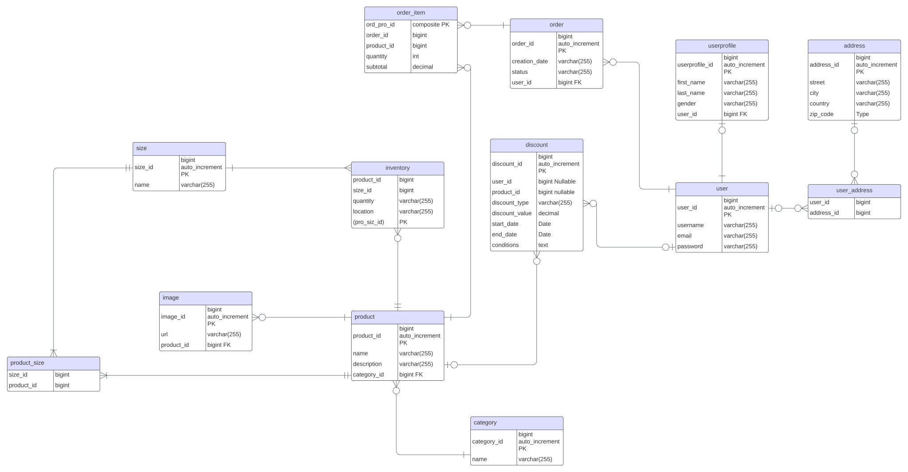

# Fullstack E-commerce Project - Backend
This repository is part of my ecommerce project. This serves as a RESTApi for my frontend which can be visited [here](https://www.github.com/Leonid10011/ecommerce-frontend).

## Currently working on:
Reworking data structure and cleaning api at **reworkProduct** branch.
## Database ER Diagram (database schema for reworked backend)

## Preview( Old. Will be updated after rework for akcend is finished and frontend is adjusted)
Hosted on : http://217.72.204.244

## Technologies Used

The project is built using the following technologies and tools:

- **Java:** As the primary programming language.

- **Quarkus:** A Kubernetes-native Java framework designed for the cloud, providing fast startup times and low memory consumption.

- **JPA (Java Persistence API):** For data persistence and management.

- **MySQL:** As the relational database for storing user data, product information, orders, and reviews.
