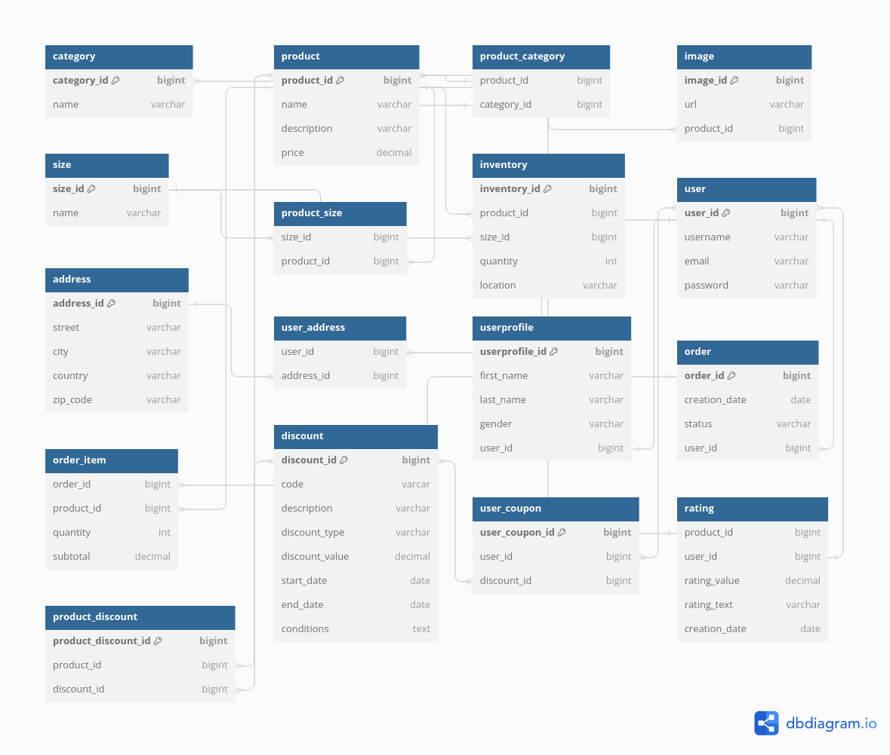

# Backend for ecommerce project
## Currently working on
Reworking backend such that it follows RESTFul specification. 

## Documentation
You can find the **openapi** specification [here](https://github.com/Leonid10011/ecommerce-backend/blob/main/openapi)

You can view it with e.g.  [swagger editor](https://editor.swagger.io/)

## Database Schema

