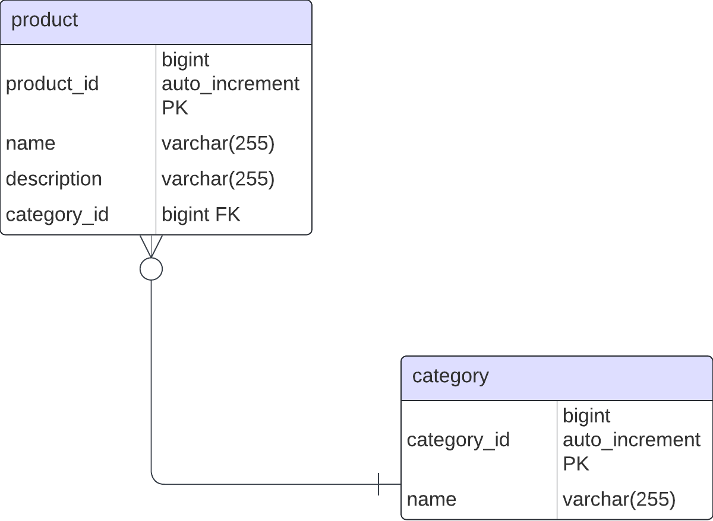

# Database Entities Documentation
## Category Entity

### Overview 
`Purpose`: This section focuses on the 'category' table, which is integral to our product management. It stores various product categories, such as t-shirts, hoodies, and more. This table acts as a centralized repository for categorizing our diverse product range.
`Relationships`: In terms of database relationships, the 'category' table maintains a One-To-Many connection with the 'products' table. This design ensures that each product is associated with exactly one category, establishing a clear, unambiguous categorization system.

### Entity Implementation
#### Entity Diagram



#### Field Description
`category_id`: The unique identifier of the category

`name`: The name of the category

#### Constraint and indexes
`none`

### Data Transfer Object
#### DTO Structure

`long` `category_id`: The category entities id.

`String` `name`: The category entities name.

#### Mapping Logic

Entity is mapped one to one on each field of the DTO.

### Repository Implementation
#### Interface
```java
public interface ICategoryRepository {
    void create(Category category);
    Optional<Category> findById(Long id);
    List<Category> findAll();
    Optional<Category> findByName(String name);
    void delete(Long id);
    void update(Category category);
}
```

### Service
#### Interface
```java
public interface ICategoryService {
    Response create(CategoryDTO categoryDTO);
    Response findAll();
    Response findById(Long id);
    Response findByName(String name);
    Response update(CategoryDTO categoryDTO);
    Response delete(Long id);
}
```

### Controller
Endpoints
#### Get Category by Name

- **METHOD** `GET`
- **URL Path**  `/api/category/{name}`
- **Request Parameters** 
  - `name` (`String`): The name of the category to be retrieved
- **Success Response**
  - **Code** `200 OK`
  - **Content**
  ```json
    {
      "category_id": "id",
      "name": "{name}"
    }
  ```
- **Error Response**
  - **Code**: `404 NOT FOUND`
  - **Content**
    ```text
    Could not find category with name: "{name}"
    ```
    - **Code**: `400 BAD REQUEST`
    - **Content**
    ```text
    Should not happen
    ```

- **Example call**
    ```shell
    curl -X GET http://example.com/api/category/name -H "Content-Type: application/json"
    ```

#### Create Category
- **Method** `POST`
- **URL Path**: `/api/category/`
- **Request Parameters**
  - None
- **Success Response**
  - **Code** `201 CREATED`
  - **Content**
    ```text
        Category created
    ```
- **Error Response**
  - **Code** `409 CONFLICT`
    ```text
        Attempt to create a category that already exists: ${categoryDTO.getName()}
    ```
  - **Code** `500 INTERNAL SERVER ERROR`
    ```text
    "Internal server error"
    ```
- **Example call**
    ```shell
      curl -X POST http://example.com/api/category/ -H "Content-Type: application/json" -d '{"name": "New Category Name"}'
    ```